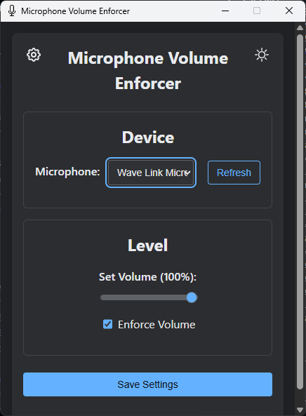
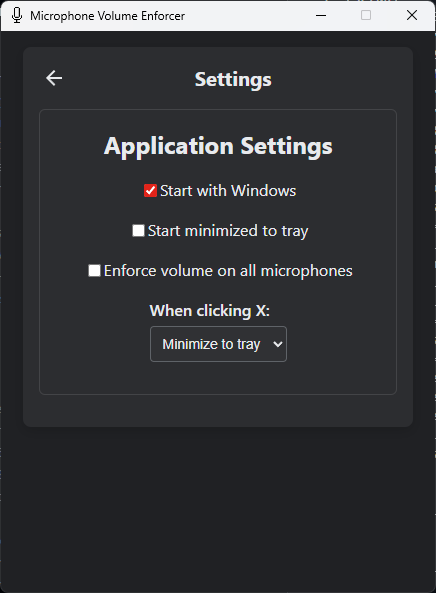

# Microphone Volume Enforcer

Small WPF app that locks your microphone input volume at whatever you set, so the next driver update, Discord, OBS, or Zoom can't quietly drop it on you.



## Install

Grab the latest installer from [Releases](https://github.com/hardtokidnap/MicrophoneVolumeEnforcer/releases/latest). User-level install, no admin prompt.

Runtime prerequisites the installer checks for:
- Windows 10 (build 17763) or 11, x64
- [.NET 10.0 Desktop Runtime](https://dotnet.microsoft.com/en-us/download/dotnet/10.0)
- [WebView2 Runtime](https://developer.microsoft.com/en-us/microsoft-edge/webview2/) (preinstalled on most Windows 10/11 systems)

## What it does

- Watches the volume on every active capture endpoint and resets it to your target within ~1 second whenever something else changes it.
- **Enforce on all microphones** (default ON): one slider value applies to every active capture device. New mics plugged in mid-session join within ~2 seconds; unplugged ones drop cleanly.
- **Start minimized to tray**: launch hidden. Set this with "Start with Windows" if you don't want the window popping up every login.
- Tray-resident with a configurable close behavior (minimize, exit, ask).
- Dark / light theme, `Alt+T` to toggle.



## Build from source

```bash
dotnet run                                                 # dev loop
dotnet publish -c Release -r win-x64 --self-contained false  # framework-dependent build
./build-installer.ps1                                      # produces installer/MicrophoneVolumeEnforcer-Setup.exe
```

Requires the .NET 10 SDK (`global.json` pins 10.0.204). Inno Setup 6 is needed for the installer script.

## File locations

| What | Where |
|---|---|
| Settings | `%APPDATA%\MicrophoneVolumeEnforcer\settings.json` |
| WebView2 user data | `%LOCALAPPDATA%\MicrophoneVolumeEnforcer\WebView2` |
| Startup registry entry | `HKCU\Software\Microsoft\Windows\CurrentVersion\Run\MicrophoneVolumeEnforcer` |

## Architecture

- C# 13 / .NET 10 WPF host
- WebView2 for the UI (vanilla HTML/CSS/JS in `wwwroot/`)
- [CoreAudio](https://github.com/morphx666/CoreAudio) for MMDevice enumeration and per-endpoint volume control
- WinForms `NotifyIcon` for the tray
- JSON settings with [System.Text.Json source generation](https://learn.microsoft.com/dotnet/standard/serialization/system-text-json/source-generation)

WebView2 surface is locked down: DevTools, default context menu, script dialogs, browser accelerator keys, external drag-drop, `window.open()`, downloads, autofill, and password autosave are all disabled. Navigation is restricted to the packaged `wwwroot/index.html`.

## Troubleshooting

- **Dropdown is empty or disabled**: if "Enforce on all microphones" is on, the dropdown stays disabled and shows "All microphones". Untick the setting to pick one device.
- **Volume keeps drifting back during a call**: drift detection has a 1-second grace period so it doesn't fight you on small tweaks. If something else is winning, check that the device shows as "Active" in Windows Sound Settings.
- **Doesn't start with Windows**: toggle "Start with Windows" off and on again in Settings to refresh the registry entry.

## Releases

Tag pushes (`v*.*.*`) trigger the [release workflow](.github/workflows/release.yml), which builds the installer on a Windows runner, pulls the matching version's section from [CHANGELOG.md](CHANGELOG.md), and publishes a GitHub release.

## License

[BSD 3-Clause](LICENSE.md). Free to use, modify, redistribute, including commercially. Credit @hardtokidnap.
